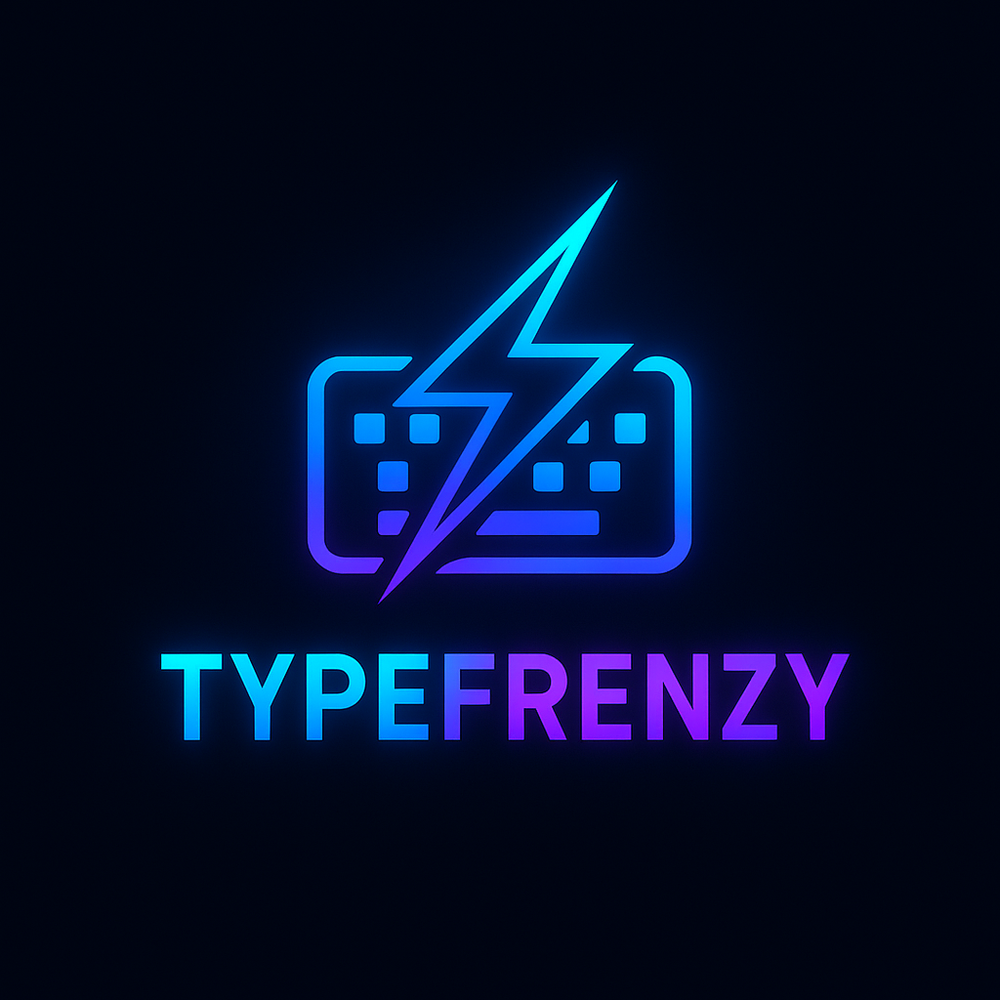

# ⌨️ TypeFrenzy – Real-Time Multiplayer Typing Battles




**Race your friends in real-time typing battles — fast fingers, faster minds.**  
TypeFrenzy is a full-stack multiplayer typing speed game with private game rooms, live leaderboards, and intense WPM challenges. Built for fun. Powered by WebSockets.

---

## ✨ Features

- 🔐 JWT-based user authentication
- 🧠 Track WPM, accuracy, and race history
- ⚡ Real-time socket-based gameplay with friends
- 🎮 Public and private race rooms
- 📊 Global leaderboard with player stats
- 🖥️ Fully responsive UI with TailwindCSS
- 👨‍👩‍👧‍👦 Multiplayer matchmaking
- 🧼 Clean and modern design
- ☁️ Deployable full-stack app

---

## 🛠️ Tech Stack

| Tech         | Description                             |
|--------------|-----------------------------------------|
| React        | Frontend framework                      |
| Tailwind CSS | Styling and responsive design           |
| Node.js      | Backend runtime                         |
| Express.js   | API routing & server logic              |
| MongoDB      | NoSQL database for persistence          |
| Socket.io    | Real-time events                        |
| JWT + bcrypt | Secure authentication & password hashing |
| Render       | Backend deployment                      |
| Vercel       | Frontend deployment                     |

---

## 🔧 Folder Structure

```
typefrenzy/
├── client/                 # React + Tailwind frontend
│   ├── components/
│   ├── pages/
│   ├── context/
│   ├── App.jsx
│   └── main.jsx
├── server/                 # Node + Express backend
│   ├── controllers/
│   ├── models/
│   ├── routes/
│   ├── sockets/
│   └── index.js
├── assets/
│   ├── typefrenzy-logo.png
│   └── typefrenzy-banner.png
└── README.md
```

---

## 🚀 Getting Started Locally

### 📦 Backend Setup

```bash
cd server
npm install
# .env file:
# MONGO_URI=<your_mongodb_connection_string>
# JWT_SECRET=<your_jwt_secret>
npm start
```

### 💻 Frontend Setup

```bash
cd client
npm install
npm run dev
```

---

## 🌐 Live Demo

🔗 Coming Soon: [https://typefrenzy.vercel.app](https://typefrenzy.vercel.app)

---

## 🧠 What I Learned

- Building multiplayer real-time systems using WebSockets
- Optimizing data sync and latency across players
- Designing structured and scalable full-stack apps
- Clean component-driven architecture with React + Tailwind
- Hosting and deployment best practices (Render + Vercel)
- Implementing competitive stat tracking systems

---

## 🛣️ Roadmap

- 🗨️ In-room chat with emojis
- 👥 Team battles and spectating mode
- 🧪 Historical race replays
- 🌐 Multi-language typing modes
- 📲 Progressive Web App (PWA) version

---

## 📢 Social Media

📮 I’ll be posting the project journey and updates here:  
🔗 [LinkedIn Project Post](https://www.linkedin.com/in/Yug-Shrivastava) <!-- Replace with actual post link once ready -->

---

## 🙋‍♂️ Author

Built with ❤️ by [Yug Shrivastava](https://github.com/YugShrivastava)

---

## 📄 License

This project is licensed under the MIT License — feel free to fork and build on it!
